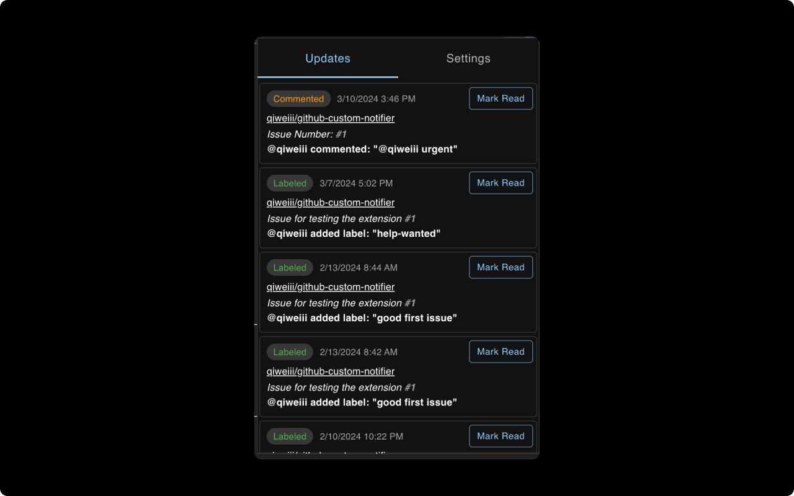
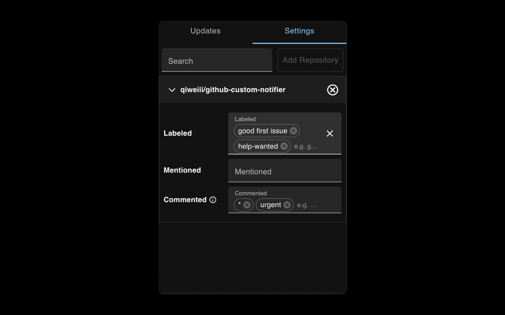
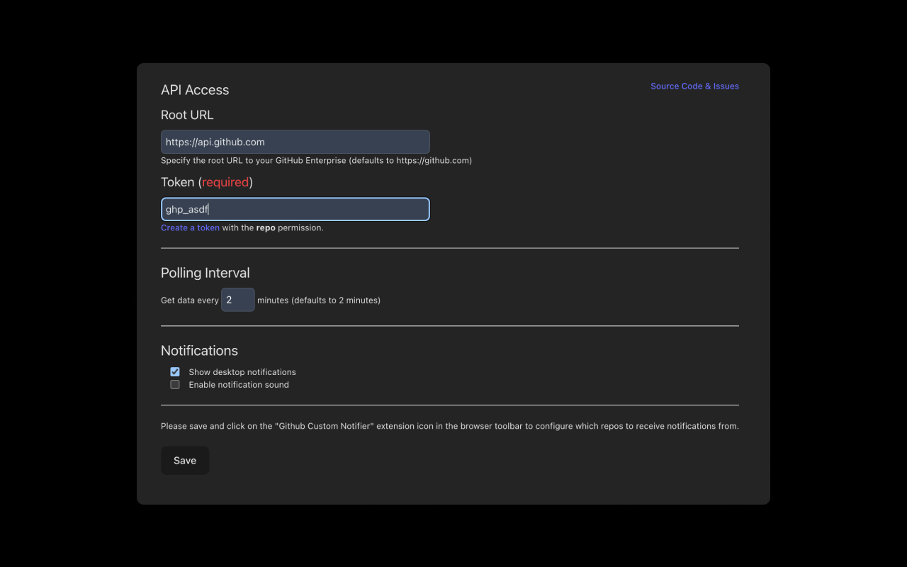

> Too many unwanted GitHub issue or PR notifications? This web extension allows you to customize which GitHub Event to be notified.

## Dev

```shell
pnpm install
pnpm dev # auto open browser with hot reload
```

## Build

```shell
pnpm install
pnpm build # build for chrome
```

Open browser extension manager, turn on developer mode, load unpacked and add `.output/chrome-mv3`.

## Screenshots

### Notifications Updates



### Configure Notifications



### Options Page



## How to add a new notification event?

Please refer to `src/lib/api` for examples.

Contribution welcomed! You could create a PR to add a new event type to get notifications from.

## Buy me a coffee ☕️

<p>
  If you like this extension, consider buying me a coffee. Your support
  will help me to continue maintaining this extension for <strong>free</strong>.
</p>
<a
  href="https://www.buymeacoffee.com/qiwei"
  target="_blank"
  rel="noopener noreferrer"
>
  
</a>
